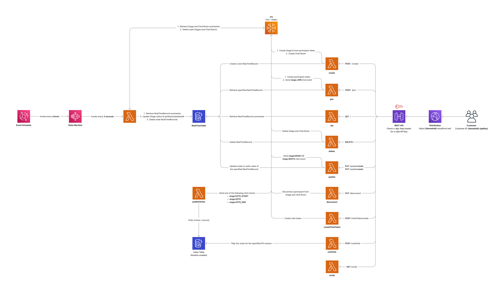

# Amazon IVS Real-time Serverless Demo

A serverless demo intended as an educational tool to demonstrate how you can build an application that enables real-time social UGC (User Generated Content) use cases using Amazon IVS Stages and Amazon IVS Chat. This README includes instructions for deploying the Amazon IVS Real-time Serverless demo to an AWS Account.

_IMPORTANT NOTE: Deploying this demo application in your AWS account will create and consume AWS resources, which will cost money._

## Prerequisites

- [AWS CLI Version 2](https://docs.aws.amazon.com/cli/latest/userguide/install-cliv2.html)
- [NodeJS](https://nodejs.org/en/) and `npm` (npm is usually installed with NodeJS)
  - If you have [node version manager](https://github.com/nvm-sh/nvm) installed, run `nvm use` to sync your node version with this project
- Access to an AWS Account with at least the following permissions:
  - Create IAM Roles
  - Create Lambda Functions
  - Create Secret Manager Secrets
  - Create Amazon IVS Stages and Chat Rooms
  - Create Amazon DynamoDB Tables
  - Create EventBridge Rules
  - Create Step Functions State Machines

For configuration specifics, refer to the [AWS CLI User Guide](https://docs.aws.amazon.com/cli/latest/userguide/cli-chap-configure.html).

## Architecture



## One-click deploy

1. Click the **Launch stack** button that corresponds to the region that is geographically closest to you

   | **North America**       |                                                                                                                                                                                                                                                                                                                                                                                   |
   | ----------------------- | --------------------------------------------------------------------------------------------------------------------------------------------------------------------------------------------------------------------------------------------------------------------------------------------------------------------------------------------------------------------------------- |
   | us-east-1 (N. Virginia) | [](https://console.aws.amazon.com/cloudformation/home?region=us-east-1#/stacks/new?stackName=IVSRealTimeDemo&templateURL=https://ivs-demos-cf-stacks-us-east-1.s3.us-east-1.amazonaws.com/IVSRealTimeDemo/c259cc716702fb68118582cb7983c4b978a724c247d63128a7fdeeb9ee363154.json) |
   | us-west-2 (Oregon)      | [](https://console.aws.amazon.com/cloudformation/home?region=us-west-2#/stacks/new?stackName=IVSRealTimeDemo&templateURL=https://ivs-demos-cf-stacks-us-west-2.s3.us-west-2.amazonaws.com/IVSRealTimeDemo/2773150ae36e62fffc8e2a3a0fadd60524056886b003fcefc2a44b4fc1ae9660.json) |

   | **Europe**               |                                                                                                                                                                                                                                                                                                                                                                                            |
   | ------------------------ | ------------------------------------------------------------------------------------------------------------------------------------------------------------------------------------------------------------------------------------------------------------------------------------------------------------------------------------------------------------------------------------------ |
   | eu-west-1 (Ireland)      | [](https://console.aws.amazon.com/cloudformation/home?region=eu-west-1#/stacks/new?stackName=IVSRealTimeDemo&templateURL=https://ivs-demos-cf-stacks-eu-west-1.s3.eu-west-1.amazonaws.com/IVSRealTimeDemo/feca40d75d8f0d7af2cd4387eaf8f930453911aefcfe1e35809ef61143abd76b.json)          |
   | eu-central-1 (Frankfurt) | [](https://console.aws.amazon.com/cloudformation/home?region=eu-central-1#/stacks/new?stackName=IVSRealTimeDemo&templateURL=https://ivs-demos-cf-stacks-eu-central-1.s3.eu-central-1.amazonaws.com/IVSRealTimeDemo/cdde254ef04a0fc5b0c8f9345708019ab42c599a639f89164c6de220aa61be1d.json) |

   | **Asia Pacific**       |                                                                                                                                                                                                                                                                                                                                                                                                  |
   | ---------------------- | ------------------------------------------------------------------------------------------------------------------------------------------------------------------------------------------------------------------------------------------------------------------------------------------------------------------------------------------------------------------------------------------------ |
   | ap-south-1 (Mumbai)    | [](https://console.aws.amazon.com/cloudformation/home?region=ap-south-1#/stacks/new?stackName=IVSRealTimeDemo&templateURL=https://ivs-demos-cf-stacks-ap-south-1.s3.ap-south-1.amazonaws.com/IVSRealTimeDemo/b13a2ce2a30cb7f33ef578a70f1ed56684bd6058a96670064a4dcd63ea3bf09d.json)             |
   | ap-northeast-1 (Tokyo) | [](https://console.aws.amazon.com/cloudformation/home?region=ap-northeast-1#/stacks/new?stackName=IVSRealTimeDemo&templateURL=https://ivs-demos-cf-stacks-ap-northeast-1.s3.ap-northeast-1.amazonaws.com/IVSRealTimeDemo/0baf2b1cd628662e8faa07e37d18b6869a513ab462586b8828e009dd4f92b23d.json) |
   | ap-northeast-2 (Seoul) | [](https://console.aws.amazon.com/cloudformation/home?region=ap-northeast-2#/stacks/new?stackName=IVSRealTimeDemo&templateURL=https://ivs-demos-cf-stacks-ap-northeast-2.s3.ap-northeast-2.amazonaws.com/IVSRealTimeDemo/032f776d5412e9c5bffabc2f49d483e83d97bcaacefb355e6c0a1012840ea276.json) |

2. Follow the steps on the **Create stack** page. You may optionally specify a different Stack name.
3. After completing all steps, select **Submit** to launch and deploy the stack.

### Use a one-click deploy backend with the client applications

When the deployment successfully completes, save the following values in the **Outputs** tab to generate your `Authentication code`. You will need to enter this code when prompted by the mobile apps:

- `domainName` (the first part of this is your `domainId`)
- `secretUrl` (used to retrieve your `apiKey`)

Open the `secretUrl` in your web browser and click the **Retrieve secret value** button in the **Secret value** section. Once the secrets are visible, copy the `apiKey` value.

To generate your `Authentication code`, join the `domainId` and `apiKey` with a dash: `${domainId}-${apiKey}`.

> For example, if your domainName is `d0abcdefghijk.cloudfront.net` and apiKey is `AbCDEFgHIJKLmnOPQrsTUV`, your authentication code is `d0abcdefghijk-AbCDEFgHIJKLmnOPQrsTUV`.

On your mobile device, simply enter this value when prompted by the app.

## Deploy from the command line

1. If this is your first time deploying the backend stack, run the following command:

   ```
   make app STACK=YOUR_STACK_NAME (default: IVSRealTimeDemo)
   ```

   Otherwise, run the following command to skip the `install` and `bootstrap` processes and go straight into deploying:

   ```
   make deploy STACK=YOUR_STACK_NAME (default: IVSRealTimeDemo)
   ```

   See [Commands](#commands) for a comprehensive list of the `app` and `deploy` options.

2. Press `y` when prompted to acknowledge and proceed with the deployment

### Use the command line deployed backend with the client applications

When the deployment successfully completes, copy the `⭐️ Domain ID` and `🔑 API key` values outputted in your terminal session. On your mobile device, simply enter these values when prompted by the app.

Alternatively, you may use the mobile app to scan the `🔎 Authentication QR code`. Doing so will automatically paste the customer ID and API key into the app and sign you in immediately.

## Tearing down the backend stack

To delete a deployed backend stack, run the following command:

```
make destroy STACK=YOUR_STACK_NAME
```

See [Commands](#commands) for a comprehensive list of the `destroy` option.

_Note: resources created after the deployment will not be deleted. Such resources may include Stages and Chat Rooms._

## Server Error Alarms

When deploying the stack using the command-line, a CloudWatch alarm will be triggered when the API returns 5 or more server errors (5XX) within 10 minutes. To receive email notifications when an alarm is triggered, you must pass an `ALARMS_EMAIL` option to the `make app` or `make deploy` commands. For example,

```
make deploy ALARMS_EMAIL=youremail@example.com
```

Once the stack has been deployed, you will receive an email from AWS prompting you to confirm the SNS topic subscription to receive email notifications.

## Commands

|                 | **Description**                                                             | **Options**                                                                    |
| --------------- | --------------------------------------------------------------------------- | ------------------------------------------------------------------------------ |
| **app**         | Installs NPM dependencies, bootstraps, and deploys the stack                | `AWS_PROFILE`, `AWS_REGION`, `STACK`, `NAG`                                    |
| **install**     | Installs NPM dependencies                                                   | -                                                                              |
| **bootstrap**   | Deploys the CDK Toolkit staging stack                                       | `AWS_PROFILE`, `AWS_REGION`, `STACK`, `NAG`                                    |
| **synth**       | Synthesizes the CDK app and produces a cloud assembly in cdk.out            | `AWS_PROFILE`, `AWS_REGION`, `STACK`, `NAG`                                    |
| **deploy**      | Deploys the stack                                                           | `AWS_PROFILE`, `AWS_REGION`, `STACK`, `NAG`, `ALARMS_EMAIL`, `TERM_PROTECTION` |
| **output**      | Retrieves the CloudFormation stack outputs                                  | `STACK`                                                                        |
| **destroy**     | Destroys the stack and cleans up                                            | `AWS_PROFILE`, `AWS_REGION`, `STACK`, `NAG`                                    |
| **clean**       | Deletes the cloud assembly directory (cdk.out)                              | -                                                                              |
| **seed**        | Creates a specified number of randomly generated demo items                 | `AWS_PROFILE`, `AWS_REGION`, `STACK`, `COUNT`, `TYPE`                          |
| **delete-seed** | Deletes all seeded items                                                    | `AWS_PROFILE`, `AWS_REGION`, `STACK`                                           |
| **publish**     | Publishes stack file assets to an S3 bucket and generate a launch stack URL | `AWS_PROFILE`, `AWS_REGION`, `STACK`, `NAG`, `FILE_ASSETS_BUCKET_NAME_PREFIX`  |
| **help**        | Shows a help message with all the available make rules                      | -                                                                              |

### Command options

`AWS_PROFILE` - named AWS CLI profile used for commands that interact with AWS. Defaults to `default`.

`AWS_REGION` - the AWS region used for commands that interact with AWS. Defaults to the region associated with your `default` AWS CLI profile.

`STACK` - the stack name. Defaults to `IVSRealTimeDemo`.

`ALARMS_EMAIL` - the email that will be receiving CloudWatch alarm notifications.

`TERM_PROTECTION` - set to `true` to enable stack termination protection. Defaults to `false`.

`NAG` - set to `true` to enable application security and compliance checks. Defaults to `false`.

`COUNT` - the number of demo items to seed (maximum is `10`). Defaults to `1`.

`TYPE` - the type of demo items to seed (either `video` or `audio`). Defaults to `video`.

`FILE_ASSETS_BUCKET_NAME_PREFIX` - the name prefix used to create or retrieve the S3 bucket to which file assets are saved from the `publish` command. This prefix is prepended with the AWS region to create the complete bucket name. Required when running the `publish` command.
